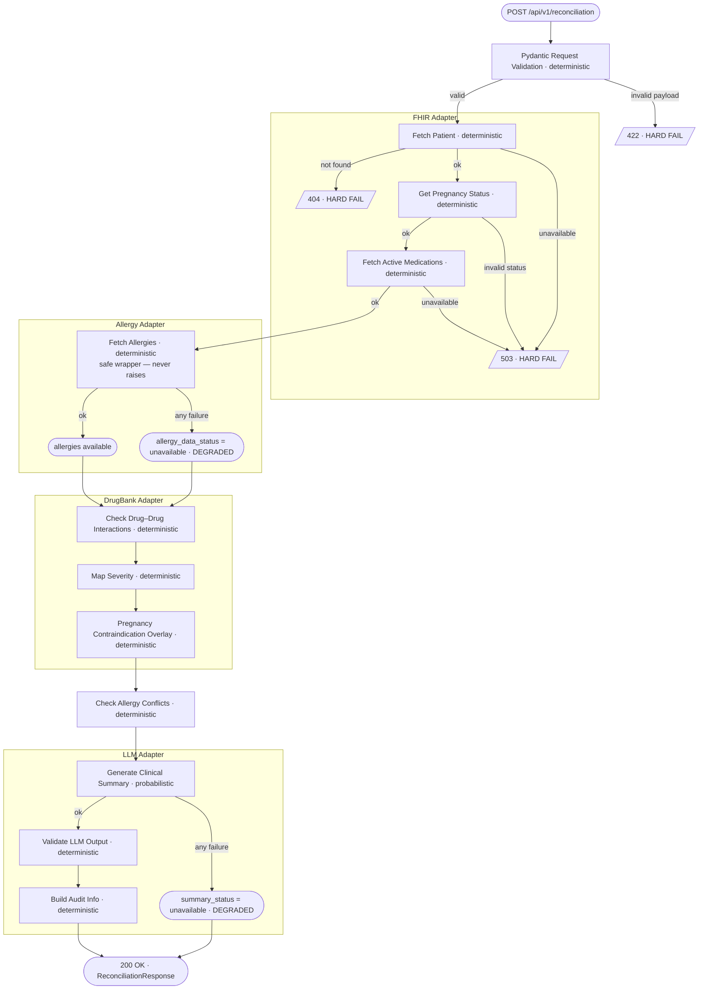

# Reconciliation Pipeline

**HARD FAIL** — stops immediately, returns an error response: patient not found (404), FHIR unavailable (503), invalid request (422).

**DEGRADED** — returns 200 with explicit status flags: `allergy_data_status = "unavailable"` if the allergy source is unreachable; `summary_status = "unavailable"` if the LLM call fails. Deterministic drug-drug and allergy data are always present in the response.
